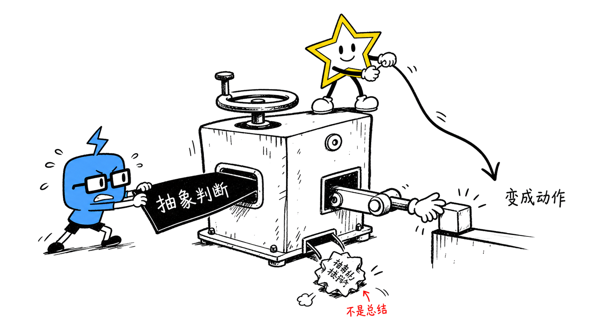
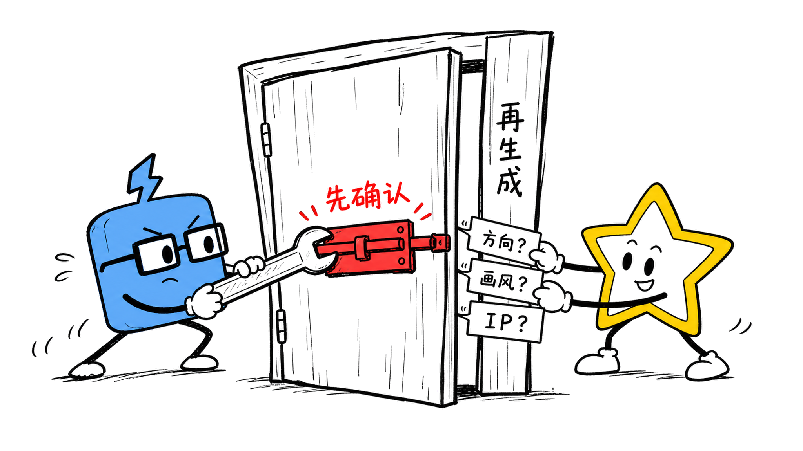

# Cognitive Anchor Sketcher

> Turn one important idea in an article into a hand-drawn body illustration people can actually remember.

[中文说明](README.md)

## 1. What is this repository?

This repository contains a Codex Skill for creating body illustrations for Chinese articles, posts, blogs, Notion pages, workflow documents, and methodology content.

The Skill reads the material first, finds one “cognitive anchor” — a judgment, action, turning point, structure, state, or metaphor — and turns it into a 16:9 horizontal hand-drawn explanation. One image carries one idea. That keeps the article from becoming a very decorative project-management board.

The default visual IP is **Xiaohei**: a solid black little character with white dot eyes, thin legs, and a blank expression. Xiaohei is not a mascot waiting in the corner for a sticker moment; it is an absurd worker seriously taking part in the system.

## 2. Who is it for?

### 2.1 A particularly good fit

- Writers of newsletters, blogs, knowledge bases, Notion pages, and product methodologies who want the image and the paragraph to make the same point.
- Content creators, product designers, and AI builders who want abstract reasoning to become visible without turning the article into a slide deck.
- People who need a repeatable visual language and a deliberate confirmation step before every generation.
- Teams or individuals using Xiaohei, TuoTuo, XingBi, their pair, or an authorized project-local custom IP.

### 2.2 Not a good fit

- Projects that need PPTX, PDF, SVG, brand key visuals, commercial posters, or dense architecture diagrams.
- A “drop in fifty prompts and silently call an API” pipeline. The only image backend allowed here is the built-in image tool exposed by a ChatGPT-authenticated Codex CLI session; this is not an API-key image generator.
- Requests to copy a custom character without a reference, provenance, or permission to use it.

## 3. What does it produce?

- A cognitive-anchor analysis: the core judgments, turns, and paragraphs that benefit from a visual explanation.
- A shot list describing placement, meaning, structure, character action, and suggested short Chinese annotations for each image.
- Individual PNG body illustrations generated after confirmation: 16:9, clean white background, black hand-drawn linework, and a small amount of useful color.
- Two style presets: `minimal-line` (the default minimalist line style) and `emotion-doodle` (black-led emotional doodle).
- Several IP choices: Xiaohei, TuoTuo, XingBi, the TuoTuo + XingBi pair, and an authorized project-local custom IP.

The default planning range is 4–8 images per article. Short article, fewer images. More images are not automatically more wisdom.

## 4. Why is it useful?

- **It turns abstract language into an action.** Readers can see what is happening instead of rereading the same paragraph three times.
- **It keeps image and copy on the same team.** Each image serves one cognitive anchor instead of competing with the article as decoration.
- **It makes a visual language reusable.** Style and IP are separate choices; Xiaohei stays Xiaohei, while TuoTuo and XingBi keep their own jobs.
- **It adds a control point before generation.** The QA dialogue confirms direction, style, IP, authorization, shot list, output specs, and generation mode before any image call.
- **It gives custom IP a boundary.** Reference, draft, authorization, and storage scope are confirmed separately; uploading a picture is not treated as unlimited permission to copy it.

## 5. Example results

The four images below are real example assets for this project. Each is a 2048×1152 (16:9) PNG. Together they show the key moves from article input and cognitive anchors to QA and style/IP selection. The project author supplied and authorized these examples for this repository; they contain no QR codes, contact details, or local file paths.

### 5.1 Finding one cognitive anchor in an article


### 5.2 Turning an abstract judgment into an action



### 5.3 Passing the QA gate before generation



### 5.4 Confirming style and IP independently


## 6. Installation

This is a Skill, not a standalone application that needs to be compiled. Copy the `cognitive-anchor-sketcher/` subdirectory into the Codex skills directory.

### macOS / Linux

```bash
git clone https://github.com/yangjing6213-dev/cognitive-anchor-sketcher.git
cd cognitive-anchor-sketcher
mkdir -p "$HOME/.codex/skills"
cp -R ./cognitive-anchor-sketcher "$HOME/.codex/skills/"
```

### Windows PowerShell

```powershell
git clone https://github.com/yangjing6213-dev/cognitive-anchor-sketcher.git
Set-Location .\cognitive-anchor-sketcher
$skillsDir = if ($env:CODEX_HOME) { Join-Path $env:CODEX_HOME 'skills' } else { Join-Path $HOME '.codex\skills' }
New-Item -ItemType Directory -Force -Path $skillsDir | Out-Null
Copy-Item -Recurse -Force .\cognitive-anchor-sketcher (Join-Path $skillsDir 'cognitive-anchor-sketcher')
```

Reopen Codex or refresh the Skill list. The Skill itself needs no extra Python, Node.js, or image API dependency; the repository’s automated contract tests use the Python 3 standard library, and actual image generation needs the built-in image tool exposed by the current Codex CLI session and an active ChatGPT login.

The repository includes two automated guardrails: `validate-skill.yml` runs the Python standard-library contract tests and validates Skill references, while `codeql.yml` scans the GitHub Actions workflows. They run automatically on pushes and pull requests and require no additional secrets.

## 7. How to use it

### Analysis and planning only

```text
Use $cognitive-anchor-sketcher
Do not generate images yet. Analyze the cognitive anchors in this Chinese article and give me a shot list of about five images.
For each image, include paragraph placement, core meaning, structure, IP action, and suggested Chinese annotations.
```

### Generate through the confirmation-based QA flow

```text
Use $cognitive-anchor-sketcher
Create body illustrations for the Chinese article below. First confirm the article direction, style, IP, shot list, and output specs one step at a time through the QA flow, then generate.
```

Each question advances one stage and provides 3–5 options. Reply with an option number or with natural language that clearly maps to an option.

### Choose a style and IP

```text
Style: emotion-doodle
IP: TuoTuo + XingBi
Requirements: 16:9, pure white background, black-led hand-drawn linework, a few colored Chinese annotations.
```

Style and IP are orthogonal choices. Style controls linework, whitespace, and color treatment; IP controls the character’s appearance, role, and allowed actions. Choosing emotional doodle will not quietly replace Xiaohei.

### Use a custom IP

```text
Use my custom IP. First check whether I uploaded a reference image; if not, ask me to upload one.
If a reference exists, show a draft for confirmation and then confirm usage scope, storage scope, and permission before generating anything.
```

Without a reference, a confirmed draft, or a clear authorization scope, the workflow stops at the gate instead of inventing a “close enough” character.

## 8. Project workflow

```text
Article input
  → Direction confirmation
  → Style confirmation
  → IP / authorization confirmation
  → Cognitive anchors and shot list
  → Output specs and generation mode
  → Final confirmation
  → One-image-at-a-time generation
  → Internal visual QA
  → User review and saving
```

1. Read the article or supplied material and locate its turns; do not sprinkle an illustration on every paragraph by reflex.
2. Confirm direction, style, IP, authorization scope, shot list, image count, and output specs in order.
3. Design one judgment, process, structure, state, or metaphor per image. The selected character must perform the core action.
4. After confirmation, call the built-in image tool exposed by the current Codex CLI session, one image at a time.
5. Check white background, whitespace, character participation, annotation density, and whether the result feels like a slide deck; then hand it to the user for review.
6. Only after acceptance, copy the chosen files to local `assets/<article-slug>-illustrations/`. Original generated files are kept in place and never overwritten.

## 9. Repository layout

```text
.
├── README.md
├── README.en.md
├── LICENSE
├── NOTICE.md
├── tests/
│   └── test_skill_contract.py
├── .github/
│   └── workflows/
│       ├── codeql.yml
│       └── validate-skill.yml
├── docs/
│   └── examples/
│       ├── 01-article-input-anchor.png
│       ├── 02-anchor-to-action.png
│       ├── 03-qa-gate.png
│       └── 04-style-ip-authorization.png
└── cognitive-anchor-sketcher/
    ├── SKILL.md
    ├── agents/
    │   └── openai.yaml
    └── references/
        ├── codex-cli-generation.md
        ├── composition-patterns.md
        ├── ip-profiles.md
        ├── prompt-template.md
        ├── qa-checklist.md
        ├── qa-dialogue-workflow.md
        ├── style-dna.md
        ├── style-presets.md
        └── xiaohei-ip.md
```

Install `cognitive-anchor-sketcher/`; `docs/examples/` is public showcase material, not a runtime dependency. Local generated outputs, custom IP profiles, and audit reports stay local under the repository’s ignore rules.

## 10. Important notes

- **Confirm before generating.** Generation, editing, and batch generation all pass through the QA gate; “generate directly” is not a secret bypass phrase.
- **Xiaohei stays unchanged.** When no IP is specified, the existing Xiaohei profile is used. TuoTuo, XingBi, and the pair appear only after explicit selection.
- **Black leads.** Both styles prioritize black linework. Blue, yellow, and orange are small identity or action accents, not a shortcut to a colorful poster.
- **Do not submit secrets.** The Skill does not read or use `OPENAI_API_KEY` or `CODEX_API_KEY`, and it does not call an Images API, SDK, or another image provider.
- **Custom IP requires rights.** Uploading a reference does not grant permission to copy it; only the explicitly confirmed scope can create a project-local profile.
- **Human review still matters.** Check content, rights, text, and publication context before sharing AI-assisted images publicly.
- **Examples are not templates.** They calibrate visual density and character participation; future images should not mechanically repeat old conveyor belts, ropes, or stamp tools.
- **Automated checks are guardrails, not substitutes.** CI and CodeQL catch some structural and security issues, but they cannot judge whether an article is actually explained well or replace human review before publication.

## 11. Related projects

None.

## 12. About the author

### Enhe

Product designer · One-person-company practitioner · AI Builder

Building a one-person company with AI.

- GitHub: [yangjing6213-dev](https://github.com/yangjing6213-dev)
- X/Twitter: [@Amenenhe_ai](https://x.com/Amenenhe_ai)
- Website: [www.enhe-tech.com.cn](https://www.enhe-tech.com.cn/)
- WeChat: `Hu-Amen`
- Email: `amen.enhe@gmail.com`

## 13. Keep exploring

This project is one tool in the author’s personal AI-built generation system. If you are also using AI for content, knowledge bases, workflows, or productization, visit [www.enhe-tech.com.cn](https://www.enhe-tech.com.cn/) for more material.

## License

MIT License. See [LICENSE](LICENSE).
